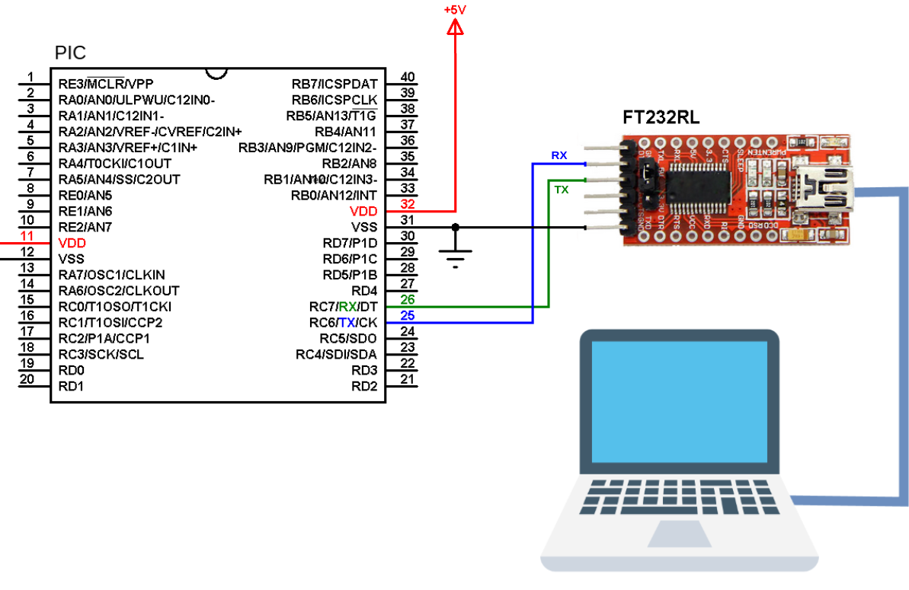

# Lab06: Comunicación UART con PIC18F45K22

## Integrantes

[Samuel Forero](https://github.com/Sam232510)

[Danna Pineda](https://github.com/Danna-pineda)

## Documentación

En este laboratorio se implementó una comunicación serial entre un microcontrolador PIC18F45K22 y un computador utilizando el protocolo UART, con el objetivo de transmitir y visualizar datos en tiempo real. Inicialmente, se configuró el microcontrolador para enviar mensajes a través del puerto serial y se verificó la correcta comunicación mediante el software PuTTY, donde fue posible observar los datos recibidos desde el sistema embebido. Posteriormente, se desarrolló un programa en Python encargado de leer la información proveniente del UART y generar una gráfica a partir de los datos obtenidos, permitiendo así analizar de forma visual el comportamiento de las señales transmitidas y comprender la integración entre hardware y software en sistemas de adquisición de datos.

Luego de entender lo que se debe realizar pasaremos a describir los codigos utilizados para este laboratorio.

# Uart.c

# Main.c

# lab6.py
## Diagramas

Figura 1. Conexión Pic18f45k22-Uart-PC

## Evidencias de implementación

En este pequeño video se observa el funcionamiento basico de la comunicación entre el el UART y el PC mediante la aplicación PuTTY. Logrando obtener el mensaje enviado desde el codigo.

En este segundo video se evidencia el programa realizado en Python el cual es un lector de voltaje esta información no la da el UART y el programa en Python lo que nos ayuda es a graficar y verificar otro medio de comunicación que no sea a tra ves de el PuTTY.